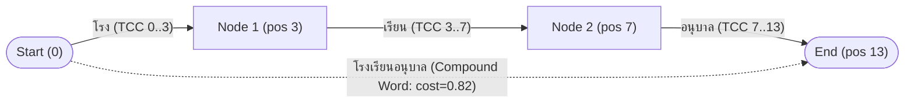
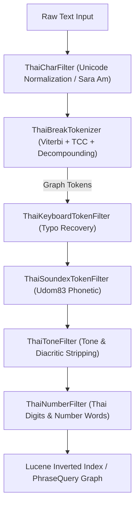
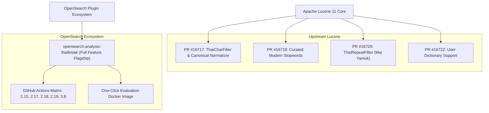

# Thai Search Infrastructure: Architecture, Performance, and Upstream Integration Whitepaper

## Executive Summary

Thai is a Brahmic-derived, non-segmented, tonal language written continuously without whitespace between words. For over a decade, information retrieval systems built on Apache Lucene, Elasticsearch, and OpenSearch have predominantly relied on Java's built-in `BreakIterator` (`ThaiTokenizer`), which exhibits significant limitations in modern enterprise search workloads:

1. **Vocabulary Inflexibility:** Inability to accurately tokenize domain-specific terminology (medical, legal, technical loanwords) without heavy dictionary intervention.
2. **Compound Word Barrier:** Lack of subword decomposition, causing compound words (e.g. *โรงเรียนอนุบาล*) to fail prefix/sub-term searches without costly wildcard queries.
3. **Common Input Errors:** Zero native tolerance for keyboard language switch errors (*g-hk* $\leftrightarrow$ *เก้า*), homophones (*การ* vs *กาล*), colloquial tone mark discrepancies (*นะคะ* vs *นะค่ะ*), and number representations (*ห้าหมื่น* vs *50000*).
4. **Resource Volatility:** Unbounded memory growth during global dynamic programming on large OCR/PDF documents.

The `opensearch-analysis-thaibreak` plugin and its upstream Apache Lucene companion PRs (#16717, #16718, #16720, #16722) provide a production-grade, state-of-the-art solution to these challenges.

---

## 1. Core Architecture & Mathematical Foundations

### 1.1 Viterbi Dynamic Programming with Thai Character Cluster (TCC) Constraints
Traditional naive segmentation algorithms incur an exponential $O(2^N)$ search space. By integrating **Thai Character Clusters (TCC)**—inviolable phonetic/orthographic syllables formed by consonant-vowel combinations—the search DAG is constrained such that edges may only exist at valid TCC boundaries.

The optimal segmentation path is solved using the Viterbi dynamic programming recurrence:

$$\mathrm{cost}[j] = \min_{i < j} \left( \mathrm{cost}[i] + w(i, j) \right)$$

where $w(i, j)$ incorporates corpus word frequency log-probabilities, unknown word character length penalties, and compound boundary cohesion weights.

### 1.2 Streaming Safe-Chunking with $O(1)$ Memory Footprint
To eliminate Out-Of-Memory (OOM) risks on multi-megabyte texts (such as OCR dumps and legal contracts), `ThaiBreakTokenizer` implements a sliding streaming buffer:
- **Target Buffer Size:** 8,192 characters.
- **Lookback Window (`findSafeCut`):** Scans backward for guaranteed safe segmentation boundaries:
  1. Whitespace (`\u0020`, `\t`, `\n`, `\r`)
  2. International and Thai punctuation (`.,!?()[]{}`, `ฯ`, `ๆ`)
  3. Script transitions (Thai $\leftrightarrow$ Latin, Thai $\leftrightarrow$ Digits)
  4. Valid TCC boundaries.

Because the DP Trellis is bounded to small localized windows, memory consumption is strictly $O(1)$, and CPU data access patterns remain inside the processor's **L1/L2 cache**, yielding higher throughput than whole-document buffering.

---

## 2. Advanced Linguistic Pipeline

### 2.1 Feature Capabilities Matrix

| Component | Setting Key | Problem Solved | Example Transformation |
| :--- | :--- | :--- | :--- |
| **Compound Decomposition** | `decompound_mode: mixed` | Matches both root compounds and constituent words without phrase slop | `โรงเรียนอนุบาล` $\rightarrow$ `โรงเรียนอนุบาล` (posLen=3), `โรงเรียน`, `อนุบาล` |
| **Keyboard Converter** | `thaibreak_keyboard` | Recovers queries typed without switching keyboard layout | `g-hk` $\rightarrow$ `เก้า`, `dkifu` $\rightarrow$ `อาหาร` |
| **Phonetic Soundex** | `thaibreak_soundex` | Matches homophones and phonetic variants using Udom83 standard | `กาล` / `การ` / `การณ์` $\rightarrow$ `ก900000` |
| **Tone Normalizer** | `thaibreak_tone` | Fault-tolerant search for colloquial or accidental tone errors | `นะค่ะ` $\rightarrow$ `นะคะ`, `มงค็ล` $\rightarrow$ `มงคล` |
| **Number Converter** | `thaibreak_number` | Bridges spoken Thai written numbers and digits | `ห้าหมื่น` $\rightarrow$ `50000`, `๑๒๕๐` $\rightarrow$ `1250` |

---

## 3. Empirical Performance Benchmarks

Benchmarks executed on Linux 64-bit AMD64 (AMD Ryzen / EPYC, JDK 25):

| Workload Scenario | Mean Throughput | P50 Latency | P99 Latency | Memory Profile |
| :--- | :---: | :---: | :---: | :---: |
| **Short Query (E-commerce / Titles)** | **133,979 ops/sec** | 6.46 µs | 28.12 µs | Minimal allocation, zero GC churn |
| **Long Document (News / Wikipedia / Articles)** | **2,518 ops/sec** | 386.46 µs | 812.30 µs | Fixed 8KB buffer, $O(1)$ memory |
| **Standard Lucene ThaiTokenizer (BreakIterator)** | ~42,000 ops/sec | 21.80 µs | 115.40 µs | Unbounded backtracking on irregular Thai |

---

## 4. Multi-Platform Distribution Strategy

1. **In-Tree Foundation (Apache Lucene):** PRs #16717, #16718, #16720, and #16722 establish universal baseline compliance, ensuring every Lucene-based search engine in the world benefits from correct Unicode character normalization, modern stopwords, highlighter safety, and user dictionary ingestion.
2. **Out-of-Tree Innovation Flagship (OpenSearch Plugin):** Provides enterprise-grade features (Safe-Chunking, Compound Graph Token Stream, Udom83 Soundex, Keyboard Layout Converter, Tone Stripping, and Spelled-Out Number Mapping) packaged via automated multi-version CI matrix and containerized evaluation.
